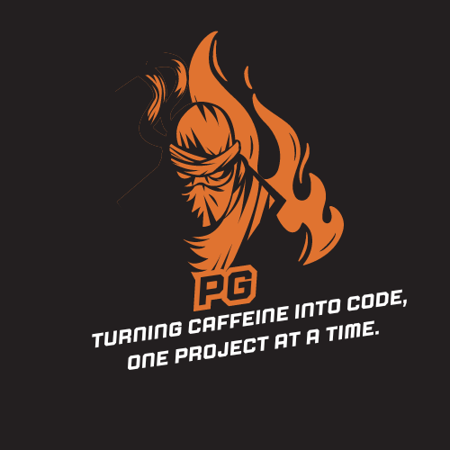

 
<h1 align="center">Hi 👋, I'm Poorav Gupta</h1>
<h3 align="center">A passionate frontend developer</h3>

  

- 🔭 I’m currently working on **CrimsonCraze - Blood Bank Management System**

- 🌱 I’m currently learning **Java frameworks like Spring Boot, Advanced Python concepts, Full-stack development, Javascript and Database Management**

- 💬 Ask me about **C, C++, Java**

- 📫 How to reach me **nanotech6798@gmail.com**

- ⚡ Fun fact **I think I’m funny but my compiler disagrees!**

<h3 align="left">Connect with me:</h3>

<h3 align="left">Languages and Tools:</h3>

       

&nbsp;

